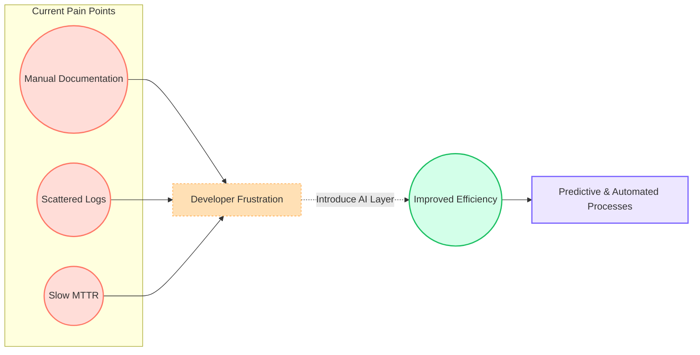
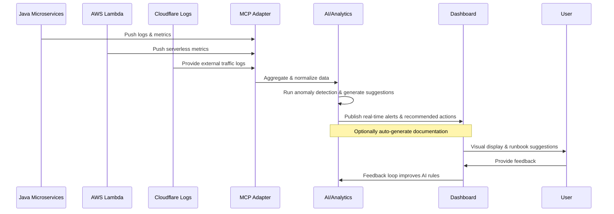

# AI-Driven Modernization POC – Detailed Breakdown

**Version**: 1.4  

This document offers a deeper look into the Proof of Concept for bringing AI-driven insights (e.g., anomaly detection, automated documentation, predictive scaling) to an existing Java microservices + serverless environment.

---

## 1) Problems Addressed
1. **Siloed Logs & Metrics**: Currently, logs come from multiple sources (Java microservices, AWS Lambda, and Cloudflare), making correlation time-consuming.
2. **Manual Documentation**: Teams must constantly update references and configurations by hand.
3. **Slow Incident Response**: Without automated alerts or predictive analytics, issues can escalate before anyone notices.
4. **Scaling Guesswork**: Determining resource levels for microservices and serverless functions often relies on trial-and-error.

### Why AI?
By leveraging an AI or analytics layer, we can unify data sources, generate real-time alerts, and automate routine tasks (such as documentation or capacity planning), thereby reducing manual overhead.

---

## 2) Key Benefits
1. **Faster Troubleshooting**: AI-based anomaly detection pinpoints issues quickly.
2. **Reduced Overhead**: Automated documentation eliminates hours of manual updates.
3. **Predictive Scaling**: Insights on future traffic help plan resource usage more efficiently.
4. **Centralized Visibility**: A unified dashboard for DevOps, engineers, and managers.

The above flowchart shows how existing pain points lead to frustration and how an AI layer can bridge gaps.

---

## 3) Proposed Data Flow
Below is a high-level sequence of events once the AI solution is in place:

### Important Details
- **MCP Adapter** merges data from microservices, serverless, and Cloudflare.
- **AI/Analytics** can be a custom microservice or integrated library for detection and prediction.
- **Dashboard** provides real-time updates, capacity planning tools, and automatic runbooks.

---

## 4) Implementation Hints
1. **MCP Adapter** – Node.js/TypeScript for parsing logs, normalizing JSON.
2. **AI/Analytics** – Could use Python (scikit-learn, PyTorch) or JavaScript-based ML.
3. **Dashboard** – React + Three.js (or other 3D libraries) for topology and real-time metrics.
4. **Cloudflare Integration** – Leverage AWS S3 or Kinesis Firehose to route logs.

---

## 5) Next Steps & Additional Value
1. **Validate Feasibility**:
   - Confirm we have enough logging detail for anomaly detection.
   - Ensure minimal overhead for the AI/analytics layer.
2. **Expand Use Cases**:
   - Add threat detection (geo-based anomalies, suspicious IPs).
   - Integrate auto-scaling triggers for serverless functions.
3. **Leverage Runbooks**:
   - Use historical incidents to create recommended steps.
   - Evolve runbook logic as the system learns from patterns.

---

## 6) Conclusion
This POC highlights how an AI-driven approach can address current pain points, reduce manual overhead, and provide real-time insights. While not production-ready yet, it establishes a solid foundation for advanced capabilities like predictive scaling, automated documentation, and integrated threat intelligence.

For more information on scope, timelines, or developer setup, refer to:
- [`projectplan.md`](./projectplan.md) – High-level schedule and deliverables.
- [`README.md`](./README.md) – Quickstart steps & disclaimers.
- [`Executive_Summary.md`](./Executive_Summary.md) – Bird’s-eye view for management and non-technical stakeholders.

