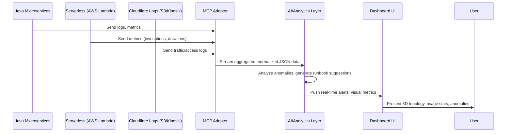

# AI-Driven Modernization POC for Java Microservices & Serverless

**Version**: 1.2

This document explores how to integrate AI-driven insights into a Java microservices + serverless ecosystem, leveraging MCP servers, automated documentation, and real-time analytics.

## 1) Overview
Many enterprise systems rely on Java microservices for core logic, often supplemented by serverless components. By layering AI and analytics on top, we achieve:

- Real-time anomaly detection.
- Automated documentation of APIs and pipelines.
- Predictive maintenance for scaling and resource planning.

## 2) Data Flow & Components

### 2.1 Detailed Data Flow Diagram

- **Java Microservices** and **Serverless** functions push logs and performance metrics to the **MCP Adapter**.
- **Cloudflare** logs (stored in AWS S3 or streamed via Kinesis) flow into the adapter for cross-system correlation.
- The **AI/Analytics Layer** handles real-time anomaly detection and runbook generation.
- The **Dashboard** displays aggregated insights in a user-friendly interface.

## 3) Implementation Highlights

1. **MCP Adapter**  
   - Written in Node.js/TypeScript to parse logs from multiple sources.  
   - Outputs a unified JSON structure for the analytics engine.

2. **AI/Analytics Layer**  
   - Could be a custom microservice (Python or Node) or integrated library for anomaly detection.  
   - Optionally leverages historical data for improved predictive modeling.

3. **Dashboard**  
   - React-based single-page app with websockets or server-sent events for real-time updates.  
   - Additional features: capacity planning simulator, runbook library, 3D topology.

## 4) Testing & Validation
- **Integration Testing**: Validate that logs from microservices, serverless, and Cloudflare merge correctly in the adapter.
- **Load Testing**: Stress the log pipeline to ensure it handles peak traffic.
- **User Acceptance**: Verify that the runbooks generated by the AI/analytics layer accurately address common issues.

## 5) Lean Canvas (Business + Technical)

| Section          | Description                                                                                             |
|------------------|---------------------------------------------------------------------------------------------------------|
| **Problem**      | Manual documentation, slow incident response, poor visibility into microservices & serverless.         |
| **Solution**     | AI-enabled dashboards, automated documentation, real-time anomaly detection with cross-system insights.|
| **Key Metrics**  | Reduced time on documentation, faster MTTR, optimal resource usage.                                    |
| **UVP**          | Single-pane-of-glass for Java + serverless logs, AI-based recommendations for scaling & runbook steps. |
| **Channels**     | Start with pilot teams (DevOps, engineering), expand across more services if successful.               |
| **Cost Structure** | Minimal new infrastructure if leveraging existing AWS environment.                                   |
| **Benefits**     | Reduced downtime, faster resolution, developer productivity gains.                                     |

