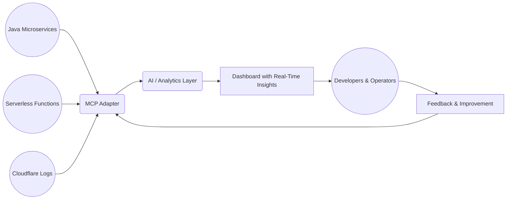

# Executive Summary – AI-Driven Modernization POC

## 1. Introduction
Many organizations operate Java microservices and serverless (e.g., AWS Lambda) applications. While these systems are functional, they often require extensive manual effort for documentation, incident response, and capacity planning. This Proof of Concept (POC) aims to introduce AI-driven enhancements that reduce operational overhead and improve reliability. **However, it is not yet development-ready and may evolve as we gather more details and feedback.**

## 2. Purpose & Scope
This Executive Summary is intended for both technical and non-technical stakeholders, including managers who need a high-level understanding of the potential value AI capabilities can bring. As we proceed, we will review existing project files to ensure no important information is missed.

### Key Points:
- **Work in Progress**: The POC is subject to significant change; new features or components may be added.
- **Integration with Existing Files**: Relevant details from the legacy Java microservices and serverless environment will be integrated to ensure consistency.
- **AI Value Proposition**: By adding an AI layer (e.g., anomaly detection, automated documentation, predictive scaling), the system can address current pain points around maintenance, responsiveness, and cost.

## 3. High-Level Advantages of AI Enhancements
1. **Reduced Manual Overhead**: Automated documentation and self-updating references can save hours each week.
2. **Faster Incident Response**: Predictive analytics and anomaly detection alert teams before issues escalate.
3. **Scalable Growth**: Data-driven insights can guide future architectural changes and resource allocation.
4. **Forward-Looking**: The POC lays groundwork for advanced features like threat detection, multi-cloud strategies, and more.

## 4. Pain Point Addressed in this POC
One of the most pressing issues is the **lack of real-time insights** across the Java microservices, serverless components, and external logs (like Cloudflare). Developers and operators spend considerable time correlating different data sources manually. This POC proposes using a Model Context Protocol (MCP) adapter to unify logs and metrics, feeding them into an AI/analytics layer that can:
- Detect abnormal patterns in real time.
- Suggest runbooks for known scenarios.
- Provide a unified dashboard for quick decision-making.

### Visual Overview

- **Java Microservices & Serverless** send logs and metrics.
- **Cloudflare** logs help correlate external traffic.
- **MCP Adapter** consolidates and normalizes data.
- **AI / Analytics Layer** detects anomalies, suggests runbooks.
- **Dashboard** presents real-time alerts and insights.
- **Feedback Loop** from users fuels continuous improvements.

## 5. Next Steps
- **Review Project Files**: Confirm we capture all existing features and constraints.
- **Iterate on Scope**: Identify which AI features add the most immediate value and refine the approach accordingly.
- **Gather Feedback**: Engage with both technical teams and management to validate feasibility and ROI.

---

This summary provides a high-level overview along with a visual diagram. For more specifics on timelines, architecture, and technical implementations, refer to the other documents (e.g., `projectplan.md`, `AI_Driven_Modernization_POC.md`, and `README.md`).

