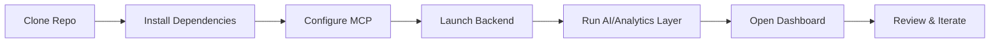

# README – AI-Driven Modernization (Work-in-Progress)

## 1. Overview

This repository showcases a Proof of Concept (POC) that integrates **AI-driven insights** into a Java microservices + serverless architecture. **Please note that this is not production-ready** and will likely evolve as we refine the scope and incorporate feedback from stakeholders. Our goal is to incrementally enhance existing systems with AI capabilities like anomaly detection, predictive scaling, and automated documentation.

## 2. Important Disclaimer

- **Work in Progress**: Features, configurations, and documentation here may change.
- **Not Fully Developed**: Expect partial implementations, placeholders, or stubs.
- **AI “Flavors”**: Potential additions include real-time anomaly detection, automated runbook generation, multi-cloud scaling insights, advanced threat detection, and more.

## 3. Project Files & Reference Docs

- **Executive\_Summary.md**: High-level overview (technical + non-technical).
- **projectplan.md**: Detailed scope, timeline, and architecture.
- **AI\_Driven\_Modernization\_POC.md**: In-depth technical breakdown of the POC.

## 4. Developer Quickstart



1. **Clone Repo**
   ```bash
   git clone https://github.com/<yourorg>/legacy-ai-dashboard.git
   cd legacy-ai-dashboard
   ```
2. **Install Dependencies**
   ```bash
   npm install
   ```
3. **Configure MCP Adapter** (dev/testing)
   ```bash
   npx @modelcontextprotocol/server-everything --port 4000
   # or any other reference MCP server
   ```
4. **Launch Express Backend**
   ```bash
   node server.js
   ```
5. **Start AI/Analytics Layer** (optional)
   - If you have a separate Python/Node microservice for anomaly detection, run it in parallel.
6. **Open Dashboard**
   - Usually served at [http://localhost:3000](http://localhost:3000) or 3001.
7. **Review & Iterate**
   - Validate logs, AI suggestions, and performance metrics.

## 5. Configuration & Environment

- **MCP Server URL**: Default is `http://localhost:4000`.
- **Express Backend**: Runs on port `3000`.
- **Front-End**: React or Vue app typically on port `8080` or `3001`.

## 6. Next Steps

- **Extend AI Features**: Add or refine anomaly detection models, predictive scaling, automated runbook generation.
- **Integrate Project Files**: Confirm logs from Java microservices, serverless, and Cloudflare are ingested properly.
- **Gather Feedback**: Discuss with stakeholders (non-technical managers, DevOps teams, architects) to validate approach.

---

For a deep dive into timelines, architecture, and potential enhancements, see [`projectplan.md`](./projectplan.md) and [`AI_Driven_Modernization_POC.md`](./AI_Driven_Modernization_POC.md).

