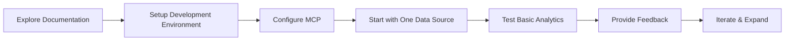

# README – AI-Driven Modernization Journey

## 1. Overview

This repository showcases a Proof of Concept (POC) that integrates **AI-driven insights** into heterogeneous technology environments combining Java microservices with serverless architectures. **This is designed as a learning tool** and will evolve as we collaborate with your team to understand your specific needs and build AI literacy within your organization. Our approach focuses on incremental enhancement through an educational journey rather than a one-time implementation.

## 2. Important Context

- **Educational Journey**: This POC serves as both a technical implementation and a learning opportunity for teams new to AI
- **Collaborative Process**: We've designed this as an adaptive approach that evolves at your organization's pace
- **Flexible Implementation**: Rather than rigid timelines, we focus on building understanding and delivering value incrementally
- **Integration Focus**: The solution connects with existing systems without requiring significant architectural changes

## 3. Project Documentation

- **[executive-summary.md](./executive-summary.md)**: High-level overview for both technical and non-technical stakeholders
- **[project-plan.md](./project-plan.md)**: Flexible implementation approach and potential capabilities
- **[technical-implementation.md](./technical-implementation.md)**: In-depth technical breakdown with educational components
- **[archive.md](./archive.md)**: Archive of previous project documentation for reference

## 4. Getting Started



### Initial Setup

1. **Clone Repository**
   ```bash
   git clone https://github.com/<yourorg>/legacy-ai-dashboard.git
   cd legacy-ai-dashboard
   ```
2. **Install Dependencies**
   ```bash
   npm install
   ```
3. **Configure MCP Adapter** (dev/testing)
   ```bash
   npx @modelcontextprotocol/server-everything --port 4000
   # or any other reference MCP server
   ```
4. **Launch Express Backend**
   ```bash
   node server.js
   ```
5. **Start with One Data Source**
   - Begin by connecting just one log source to validate the approach
   - Experiment with basic anomaly detection before adding complexity
   
6. **Review Dashboard**
   - Usually served at [http://localhost:3000](http://localhost:3000) or 3001
   - Start with the simplified view before exploring advanced features

## 5. Configuration & Environment

- **MCP Server URL**: Default is `http://localhost:4000`
- **Express Backend**: Runs on port `3000`
- **Front-End**: React app typically on port `8080` or `3001`

## 6. Learning Path & Next Steps

This repository is designed to facilitate a collaborative learning journey:

1. **Discovery Phase**: Understanding your unique environment and challenges
   - Inventory available log sources and understand their formats
   - Identify key metrics that would be most valuable to monitor

2. **Technology Foundations**: Building AI literacy within your technical teams
   - Explore the basics of data normalization and integration
   - Understand how statistical anomaly detection works

3. **Incremental Implementation**: Starting simple and expanding gradually
   - Begin with one data source before adding more
   - Start with basic statistical models before exploring ML approaches

4. **Feedback & Refinement**: Learning from real usage
   - Establish feedback mechanisms for alert quality
   - Document learnings and adjust approach based on team feedback

5. **Capability Expansion**: As understanding grows, add more sophistication
   - Gradually connect additional data sources
   - Introduce more advanced AI capabilities as your team's comfort increases

---

For a deeper understanding of our approach, refer to [project-plan.md](./project-plan.md) and [technical-implementation.md](./technical-implementation.md). For a high-level overview suitable for management, see [executive-summary.md](./executive-summary.md).

