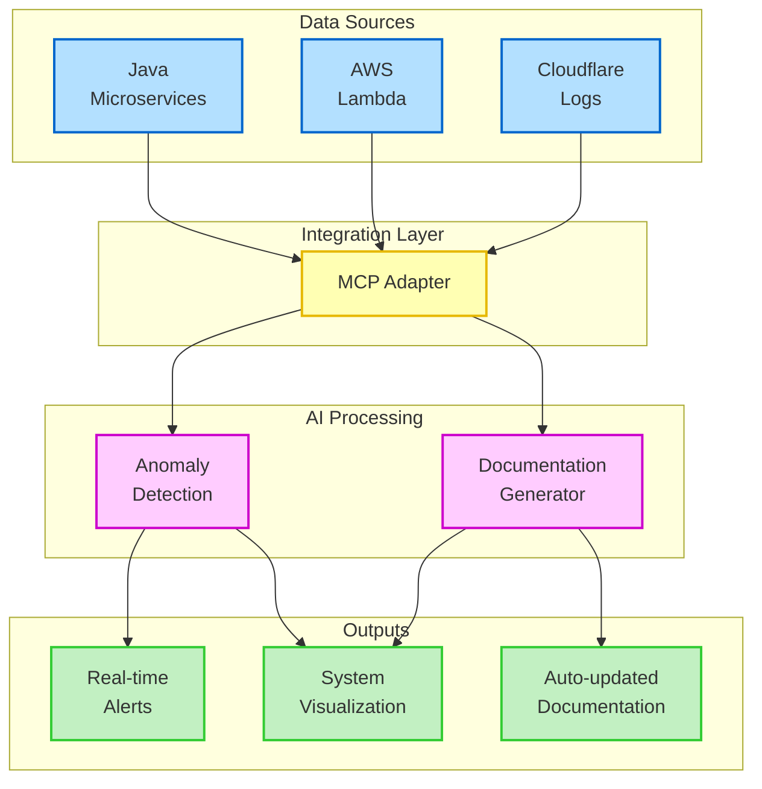

# Executive Summary – AI-Driven Modernization POC

## 1. Introduction

Modern enterprises increasingly operate heterogeneous technology environments that combine traditional applications with cloud-native architectures. Many organizations have invested in Java microservices alongside serverless components (e.g., AWS Lambda, Cloudflare Workers) to achieve scalability and flexibility. While these systems deliver business value, they often create operational silos that require extensive manual effort for monitoring, documentation, and incident response. This Proof of Concept (POC) introduces AI-driven capabilities designed to bridge these gaps while acknowledging that AI adoption should be approached as an educational journey rather than a one-time implementation.

## 2. Purpose & Scope

This Executive Summary is intended for both technical and non-technical stakeholders, including managers who need a high-level understanding of the potential value AI capabilities can bring to their technology operations. We recognize that for many organizations, this represents an initial exploration into practical AI applications.

### Key Points:

- **Educational Approach**: This POC serves as both a technical implementation and a learning opportunity for teams exploring AI integration
- **Flexible Implementation**: Rather than rigid timelines, we focus on an adaptive approach that evolves at your organization's pace
- **Value-First Philosophy**: Each capability is selected based on tangible operational benefits, not simply implementing AI for its own sake
- **Integration Strategy**: The solution connects with existing systems without requiring significant architectural changes

## 3. Enterprise Readiness Considerations

Before implementing the selected use cases, several enterprise-grade requirements have been identified:

### Security & Compliance

- OAuth2 authentication for all MCP endpoints
- Integration with enterprise IAM/SSO systems
- Secure credential management using enterprise vaults
- Data protection and retention policies
- Audit logging for compliance

### Scalability & Operations

- Containerized deployment with Kubernetes
- Message queue for high-volume log ingestion
- Comprehensive monitoring and alerting
- Automated testing and CI/CD pipeline

For detailed analysis, see [Enterprise_Readiness_Assessment.md](./Enterprise_Readiness_Assessment.md).

## 4. Selected AI Use Cases

After evaluating several potential applications for AI in modern enterprise environments, we've selected two high-value use cases for this POC:

### Primary Use Case: Real-time Anomaly Detection & Insights

Our main focus is using AI to detect abnormal patterns across distributed systems. This addresses a critical pain point: the lack of unified visibility across multiple platforms and the resulting delays in incident response.

### Secondary Use Case: Automated Documentation

To complement our primary use case, we'll also implement automated documentation generation and maintenance, reducing the manual overhead of keeping system documentation current.

### Selection Criteria

We selected these use cases based on:

- **Business Impact**: Potential to reduce downtime and improve operational efficiency
- **Technical Feasibility**: Achievable with current data sources and reasonable effort
- **Learning Value**: Provides clear demonstrations of AI's practical benefits
- **Future Extensibility**: Forms a foundation for additional AI capabilities as your organization's comfort level increases

For the full analysis of considered use cases, see the [project-plan.md](./project-plan.md) document.

## 5. High-Level Advantages of AI Enhancements

1. **Reduced Manual Overhead**: Automated documentation and self-updating references can save hours each week
2. **Faster Incident Response**: Analytics-driven anomaly detection alerts teams before issues escalate
3. **Organizational Learning**: Builds AI literacy and practical experience within your teams
4. **Scalable Growth**: Data-driven insights can guide future architectural decisions and resource allocation
5. **Forward-Looking**: The POC lays groundwork for more advanced AI capabilities as your organization matures

## 6. Technical Solution Overview

The selected use cases will be implemented through an integrated solution that addresses the challenge of siloed information across Java microservices, serverless components, and external services. This POC proposes using a Model Context Protocol (MCP) adapter to unify logs and metrics, feeding them into an AI/analytics layer that can:

- Detect abnormal patterns and bring them to immediate attention
- Suggest potential remediation steps based on historical patterns
- Provide a unified dashboard for comprehensive visibility
- Automatically generate and maintain system documentation

For detailed information about how end users will interact with the system, including the authentication process, real-time visualization, AI-generated alerts, and runbook execution, see [technical-implementation.md#55-end-user-interaction-flow](./technical-implementation.md#55-end-user-interaction-flow).

### Visual Solution Overview

## 7. Collaborative Learning Journey

Rather than prescribing specific outcomes with rigid metrics, we propose a collaborative learning approach:

1. **Discovery Phase**: Understanding your unique environment and challenges
2. **Technology Workshops**: Building AI literacy within your technical teams
3. **Incremental Implementation**: Starting with simple integrations and basic AI capabilities
4. **Feedback & Refinement**: Learning from real usage to improve the solution
5. **Capability Expansion**: Gradually introducing more sophisticated AI features as comfort grows

This approach ensures the technology evolves with your organization's understanding and needs, rather than forcing adoption before your teams are ready.

## 8. Expected Business Outcomes

- **Significant Reduction** in time spent manually correlating information during incidents
- **Improved Operational Efficiency** through better visibility and proactive alerting
- **Reduced Documentation Burden** through automated generation and maintenance
- **Increased Cross-team Collaboration** with shared visibility into system behavior
- **Growing AI Literacy** within your technical teams
- **Foundation for Future Innovation** as your organization matures in AI adoption

## 9. Next Steps

- **Collaborative Discovery**: Work together to understand your specific environment and needs
- **Educational Workshops**: Begin building AI literacy within your technical teams
- **Initial Implementation**: Start with a small-scale proof of concept focused on one data source
- **Iterative Improvement**: Gather feedback and refine the approach based on real-world usage

---

This summary provides a high-level overview of our approach. For more specifics on:

- **Developer Setup & Quickstart**: Refer to [README.md](./README.md)
- **Project Approach & Details**: See [project-plan.md](./project-plan.md)
- **Technical Implementation**: Review [technical-implementation.md](./technical-implementation.md)
