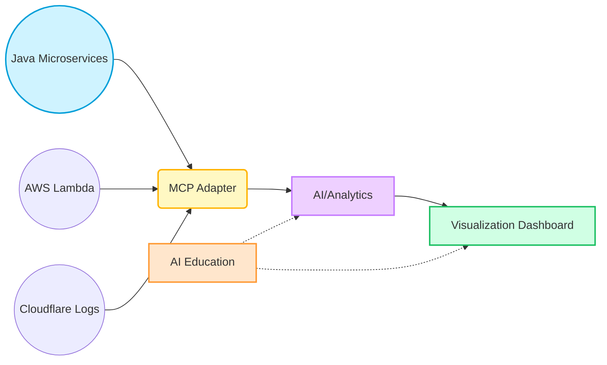
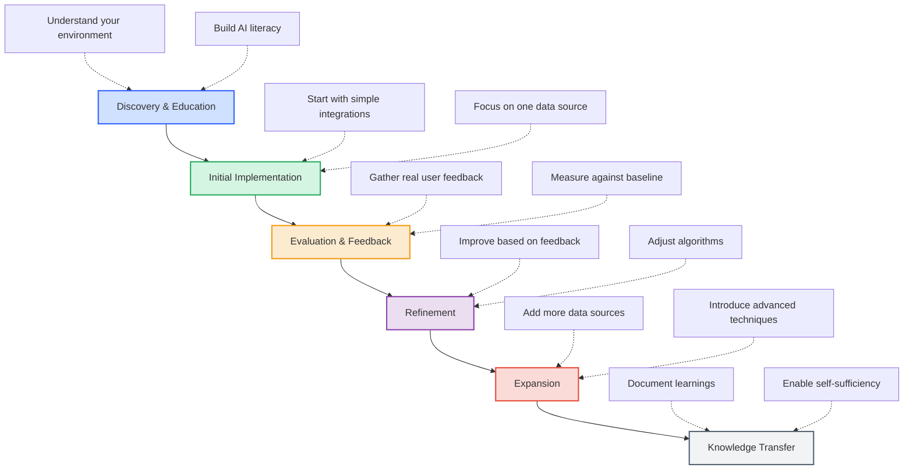

# AI-Driven Modernization POC for Java Microservices & Serverless

**Version**: 2.0  

This document outlines the overall project approach, including scope, high-level architecture, and validation strategies for organizations beginning their AI journey. **Note that this is an adaptive learning plan** designed to be flexible as we collaborate and discover what works best for your specific environment.

---

## 1) Project Summary

We aim to enhance an existing Java microservices + serverless environment with AI-driven capabilities—such as automated documentation, anomaly detection, and predictive scaling—by introducing a Model Context Protocol (MCP) adapter and a real-time analytics layer.

### Key Objectives
1. **Reduce Manual Documentation** – By auto-generating system references for microservices and serverless components.
2. **Boost Observability** – Unify logs from Cloudflare, AWS, and Java microservices into a single view.
3. **Improve Incident Response** – Leverage AI analytics to detect anomalies early and provide runbook suggestions.
4. **Build AI Familiarity** – Introduce AI concepts gradually to build organizational understanding and confidence.

---

## 2) Project Scope & Deliverables
- **In-Scope**
  - Creating an MCP adapter to gather and normalize logs/metrics.
  - Building an AI/analytics layer for real-time anomaly detection.
  - Providing visualization tools to present insights effectively.
  - Educational workshops to build AI literacy within your organization.

- **Out-of-Scope**
  - Full refactoring of existing microservices.
  - Large-scale data warehousing.
  - Advanced governance or compliance frameworks.

### Visual Overview of Scope

---

## 3) Collaborative Learning Approach
Instead of rigid timelines, we propose an adaptive learning approach that respects your organization's pace and comfort level with AI technologies.

### 3.1 Collaborative Journey Phases

This flexible approach ensures we can adapt to your organization's learning curve and business priorities without forcing artificial deadlines. Each phase will conclude with a collaborative assessment to determine readiness for advancement.

---

## 4) AI Use Cases Evaluation & Selection

After evaluating multiple potential use cases for AI integration, we've prioritized them based on feasibility, impact, and alignment with current business needs:

### 4.1 Potential Use Cases Considered
| Use Case | Description | Feasibility | Business Impact | Selected |
|----------|-------------|-------------|----------------|----------|
| **Anomaly Detection** | Identify unusual patterns in service performance, traffic, or resource usage | High | High | ✅ |
| **Predictive Scaling** | Anticipate resource needs before traffic spikes occur | Medium | High | Planned for Future |
| **Automated Documentation** | Generate & maintain technical documentation from code and logs | High | Medium | ✅ |
| **Incident Classification** | Auto-categorize alerts and suggest response priority | Medium | Medium | Planned for Future |
| **Root Cause Analysis** | Identify likely sources of failures or performance issues | Low | High | Future Consideration |
| **Security Threat Detection** | Identify potential security breaches or unusual access patterns | Low | High | Future Consideration |
| **Cost Optimization** | Suggest resource allocation changes to reduce cloud costs | Medium | Medium | Future Consideration |

### 4.2 Primary Use Case: Real-time Anomaly Detection & Insights

For this POC, we've selected **Real-time Anomaly Detection & Insights** as our primary use case due to its:

1. **Immediate Value**: It addresses the pressing issue of correlating scattered logs and detecting issues before they impact users
2. **Technical Feasibility**: We can implement this with existing log data and modern ML algorithms
3. **Measurable Impact**: Success can be quantified through metrics like Mean Time To Resolution (MTTR) and false positive rates
4. **Educational Value**: Provides a clear demonstration of AI capabilities in a familiar context

The selected use case will:
- Unify logs from Java microservices, AWS Lambda, and Cloudflare
- Apply machine learning to detect anomalies in real-time
- Generate contextual alerts with suggested mitigation steps
- Build a feedback loop to improve detection accuracy over time

**Secondary Use Case**: We will also implement **Automated Documentation** as it complements our primary use case with relatively low additional effort.

---

## 5) Implementation & Integration Plan

### 5.1 MCP Adapter
- **Purpose**: Aggregate logs from Java microservices, AWS Lambda, and Cloudflare.
- **Tech Stack**: Node.js/TypeScript.
- **Outputs**: Uniform JSON stream for the AI/analytics layer.
- **Learning Component**: Understanding data normalization and integration principles.

### 5.2 AI/Analytics Layer
- **Objective**: Real-time anomaly detection, with potential for auto-scaling suggestions.
- **Tech Stack**: Python microservice, or integrated Node module using libraries (e.g., TensorFlow.js, scikit-learn).
- **Progressive Implementation**: Starting with statistical methods before introducing more complex ML models.
- **Educational Workshops**: Providing your team with understanding of how the models work.

### 5.3 Visualization Dashboard
- **Goal**: Provide visual representations of system behavior and AI-generated insights.
- **Tools**: React with visualization libraries like D3.js (with optional 3D views using Three.js).
- **Complexity Levels**: Multiple views from simple to advanced to accommodate different user preferences.

---

## 6) Testing & Validation Plan
1. **Unit Tests**: Validate MCP adapter, parsing logic, and AI/analytics modules.
2. **Integration Tests**: Ensure data flows from microservices → adapter → analytics → dashboard.
3. **Performance/Load Tests**: Assess impact under various volumes of logs.
4. **User Acceptance Testing (UAT)**: Engage DevOps and business stakeholders for feedback on alerts, UI, and runbook practicality.
5. **AI Accuracy Validation**: Develop methods to measure and improve AI suggestion quality.

---

## 7) Success Metrics & Learning Objectives

### 7.1 Business Success Metrics
- **Improved Visibility**: Unification of logs from multiple sources into a single view
- **Faster Resolution**: Reduction in time to detect and resolve issues
- **Reduced Manual Effort**: Less time spent on documentation maintenance
- **AI Literacy**: Increased organizational comfort with AI technologies

### 7.2 Technical Learning Objectives
- **AI Fundamentals**: Understanding how ML models can enhance IT operations
- **Data Integration**: Knowledge of normalizing heterogeneous data sources
- **Model Tuning**: Experience in adjusting and improving AI model performance
- **Feedback Loops**: Creating mechanisms for humans to improve AI systems over time

### 7.3 Long-term Value Assessment
- **ROI & Productivity**: Evaluate time saved vs. investment in AI
- **Scalability**: Assess performance as system size and complexity grows
- **Team Capability**: Measure growth in AI competency within your organization
- **Future Applications**: Identify new opportunities for AI implementation

---

This approach is designed to be collaborative and educational. We'll work closely with your team, adjusting our pace and focus areas based on your feedback and comfort level with the technology. Refer to [executive-summary.md](./executive-summary.md) and [technical-implementation.md](./technical-implementation.md) for additional context. For quick setup instructions, see our [README.md](./README.md).