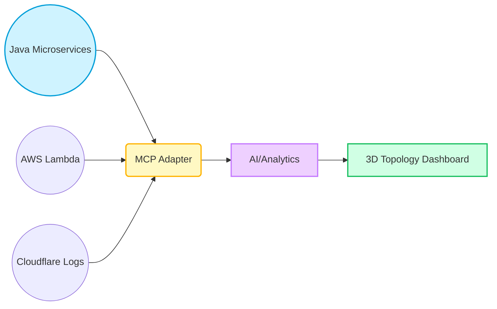
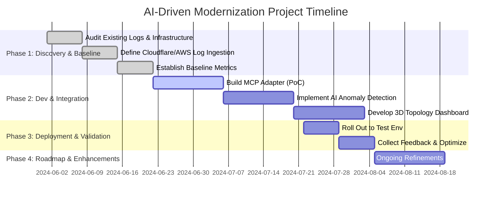

# AI-Driven Modernization POC for Java Microservices & Serverless

**Version**: 1.3  

This document outlines the overall project plan, including scope, high-level architecture, a proposed timeline, and validation strategies. **Note that this plan may change** as we refine requirements and incorporate the details from existing project files.

---

## 1) Project Summary

We aim to enhance an existing Java microservices + serverless environment with AI-driven capabilities—such as automated documentation, anomaly detection, and predictive scaling—by introducing a Model Context Protocol (MCP) adapter and a real-time analytics layer.

### Key Objectives
1. **Reduce Manual Documentation** – By auto-generating system references for microservices and serverless components.
2. **Boost Observability** – Unify logs from Cloudflare, AWS, and Java microservices into a single view.
3. **Improve Incident Response** – Leverage AI analytics to detect anomalies early and provide runbook suggestions.
4. **Future-Proof Scalability** – Lay a foundation for advanced features (e.g., threat detection, multi-cloud expansions).

---

## 2) Project Scope & Deliverables
- **In-Scope**
  - Creating an MCP adapter to gather and normalize logs/metrics.
  - Building an AI/analytics layer for real-time anomaly detection.
  - Providing a 3D topology dashboard to visualize microservices and potential bottlenecks.

- **Out-of-Scope**
  - Full refactoring of existing microservices.
  - Large-scale data warehousing.
  - Advanced governance or compliance frameworks.

### Visual Overview of Scope

---

## 3) Timeline & Phases
We propose a phased approach for development and integration, acknowledging this is a **work in progress** that may evolve.

### 3.1 High-Level Gantt Chart

**Note**: Dates and durations are placeholders; actual milestones may shift as we discover more about the existing codebase and production constraints.

---

## 4) Implementation & Integration Plan

### 4.1 MCP Adapter
- **Purpose**: Aggregate logs from Java microservices, AWS Lambda, and Cloudflare.
- **Tech Stack**: Node.js/TypeScript.
- **Outputs**: Uniform JSON stream for the AI/analytics layer.

### 4.2 AI/Analytics Layer
- **Objective**: Real-time anomaly detection, with potential for auto-scaling suggestions.
- **Tech Stack**: Python microservice, or integrated Node module using libraries (e.g., TensorFlow.js, scikit-learn).
- **Future Possibilities**: Threat detection, predictive maintenance, multi-region capacity planning.

### 4.3 3D Topology & Dashboard
- **Goal**: Provide a visual, interactive representation of microservices and serverless functions.
- **Tools**: React + Three.js, or any 3D library.
- **Runbook Suggestions**: AI-based recommendations for incident handling and resource optimization.

---

## 5) Testing & Validation Plan
1. **Unit Tests**: Validate MCP adapter, parsing logic, and AI/analytics modules.
2. **Integration Tests**: Ensure data flows from microservices → adapter → analytics → dashboard.
3. **Performance/Load Tests**: Stress test under heavy volumes of logs.
4. **User Acceptance Testing (UAT)**: Engage DevOps and business stakeholders for feedback on alerts, UI, and runbook practicality.

---

## 6) Final Analysis & Roadmap

### 6.1 Post-POC Considerations
- **ROI & Productivity**: Evaluate time saved vs. investment in AI.
- **Scalability**: Assess overhead of real-time analytics at scale.
- **Security**: Ensure logs and dashboards meet data governance standards.

### 6.2 Longer-Term Enhancements
- **Threat Intelligence**: Integration of geo-based analytics or advanced anomaly detection for suspicious traffic.
- **Multi-Cloud Support**: Potentially ingest logs from Azure, GCP.
- **Compliance Tools**: Automated checks for HIPAA, PCI-DSS, etc.

---

This plan is a living document. As we incorporate details from existing project files and gather stakeholder feedback, timelines and deliverables may shift. Refer to [`Executive_Summary.md`](./Executive_Summary.md) and [`AI_Driven_Modernization_POC.md`](./AI_Driven_Modernization_POC.md) for additional context.

