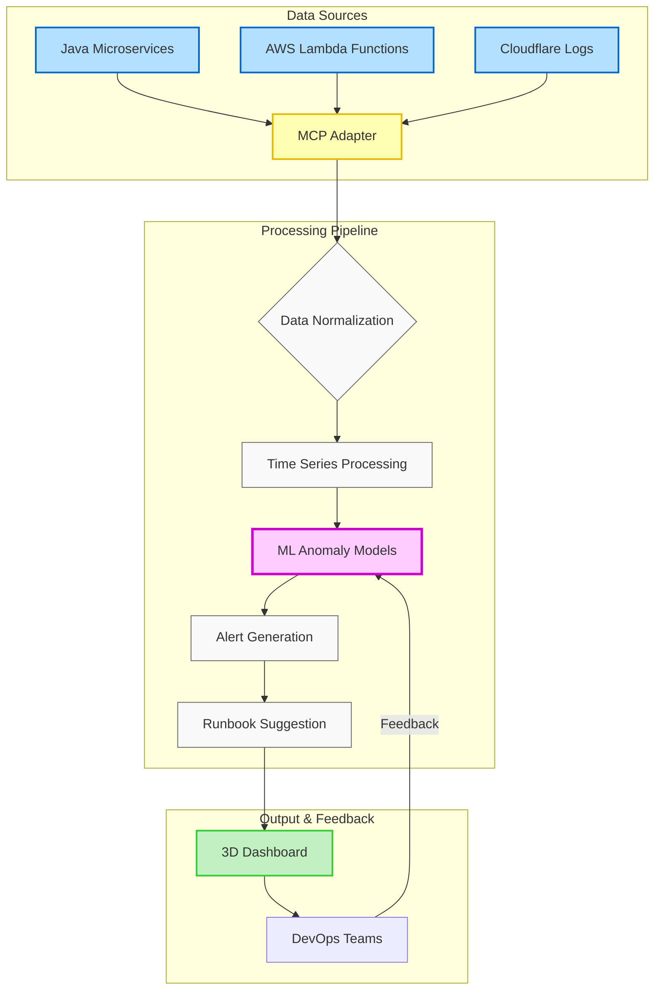
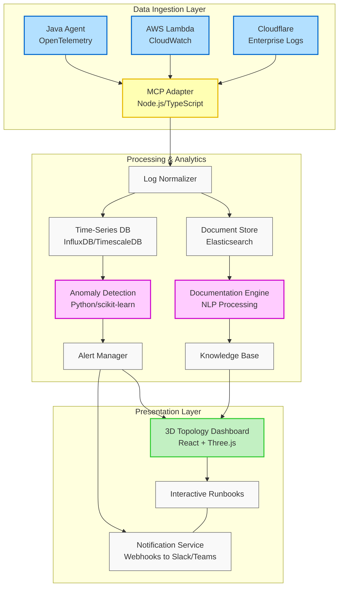
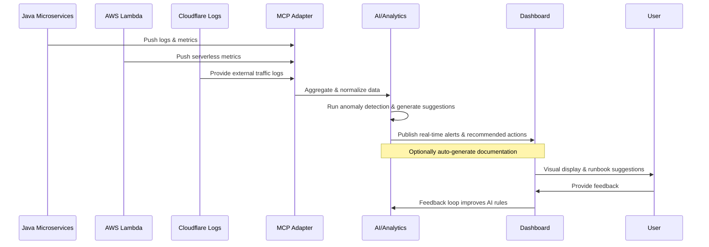

# AI-Driven Modernization POC – Detailed Technical Implementation

**Version**: 2.0  

This document offers a deeper look into the Proof of Concept for bringing AI-driven insights (e.g., anomaly detection, automated documentation, predictive scaling) to an existing Java microservices + serverless environment. This is designed as an educational journey for organizations beginning their AI adoption.

---

## 1) Problems Addressed
1. **Siloed Logs & Metrics**: Currently, logs come from multiple sources (Java microservices, AWS Lambda, and Cloudflare), making correlation time-consuming.
2. **Manual Documentation**: Teams must constantly update references and configurations by hand.
3. **Slow Incident Response**: Without automated alerts or predictive analytics, issues can escalate before anyone notices.
4. **Scaling Guesswork**: Determining resource levels for microservices and serverless functions often relies on trial-and-error.

### Why AI?
By leveraging an AI or analytics layer, we can unify data sources, generate real-time alerts, and automate routine tasks (such as documentation or capacity planning), thereby reducing manual overhead.

---

## 2) Selected Use Cases & Technical Approach

After evaluating multiple AI integration opportunities (see [project-plan.md](./project-plan.md) for the full analysis), we've selected two high-value use cases for this POC:

### 2.1 Primary Use Case: Real-time Anomaly Detection
This use case focuses on detecting abnormal patterns in service behavior, resource usage, and user interactions by:



**Technical Implementation Details:**
- **AI Learning Journey**: We'll start with basic statistical methods before introducing more advanced ML techniques, allowing your team to learn and grow with the technology
- **Threshold Customization**: Working together to determine appropriate sensitivity thresholds based on your specific business needs
- **Contextual Alerting**: Combining anomaly detection with service dependency mapping to reduce alert noise
- **Runbook Collaboration**: Creating an initial set of suggested remediation steps that improve over time with your team's input

### 2.2 Secondary Use Case: Automated Documentation
This complementary use case helps maintain up-to-date system documentation by:
- Auto-discovering service relationships and dependencies
- Generating API documentation from actual usage patterns
- Creating initial runbooks templates that your team can enhance
- Building a searchable knowledge base that grows with your system

---

## 3) Technology Stack & Component Architecture



---

## 4) Proposed Data Flow
Below is a high-level sequence of events once the AI solution is in place:



---

## 5) Implementation Guidelines

### 5.1 Flexible Implementation Approach
Rather than committing to rigid timelines, we suggest an iterative approach:

1. **Discovery Phase**: Collaborate to fully understand your environment and specific needs
2. **Educational Workshops**: Train your team on AI concepts and how they apply to your systems
3. **Proof of Concept**: Start with a small-scale implementation focused on one data source
4. **Evaluate & Learn**: Assess results together and determine next steps based on value delivered
5. **Gradual Expansion**: Incrementally add more data sources and AI capabilities as confidence grows

### 5.2 MCP Adapter Implementation
The Model Context Protocol adapter serves as the central integration point for our diverse data sources:

```typescript
// Sample MCP Adapter code structure
import { MCPServer } from '@modelcontextprotocol/server';
import { CloudflareLogParser } from './parsers/cloudflare';
import { AwsLambdaParser } from './parsers/aws';
import { JavaMicroserviceParser } from './parsers/java';

class AnomalyDetectionMCPAdapter {
  private mcpServer: MCPServer;
  private normalizer: LogNormalizer;
  
  constructor() {
    this.mcpServer = new MCPServer({ port: 4000 });
    this.normalizer = new LogNormalizer();
    this.registerParsers();
    this.setupAnomalyDetection();
  }
  
  private registerParsers() {
    // Register parsers for different log formats
    this.mcpServer.registerParser('/cloudflare', new CloudflareLogParser());
    this.mcpServer.registerParser('/aws', new AwsLambdaParser());
    this.mcpServer.registerParser('/java', new JavaMicroserviceParser());
  }
  
  private setupAnomalyDetection() {
    // Connect to anomaly detection service
    // Setup webhooks for alerts
  }
  
  // Additional implementation details...
}
```

### 5.3 Anomaly Detection Models - A Progressive Approach
We recommend starting simple and progressively increasing complexity as your team gains familiarity:

1. **Initial Phase**: Basic statistical models that are easy to understand and validate
   - Simple threshold-based anomaly detection
   - Moving average deviation alerts
   - Seasonality-aware baseline comparison
   
2. **Intermediate Phase**: More sophisticated techniques as comfort with AI increases
   - Z-score analysis for simple metrics
   - CUSUM (Cumulative Sum) for detecting small, persistent shifts
   
3. **Advanced Phase**: Deep learning models once the foundation is established
   - LSTM (Long Short-Term Memory) networks for sequence analysis
   - Isolation Forests for detecting outliers in high-dimensional data
   - Autoencoders for unsupervised anomaly detection

### 5.4 3D Topology Visualization
The dashboard will visualize the system using:
- React for the UI framework
- Three.js for 3D rendering (with optional fallback to 2D visualizations)
- D3.js for data-driven visualizations
- WebSockets for real-time updates

---

## 6) Next Steps & Learning Path
1. **Begin with Exploration**:
   - Inventory available log sources and understand their formats
   - Identify key metrics that would be most valuable to monitor
   - Start small with one or two log sources before expanding

2. **Build Organizational AI Knowledge**:
   - Conduct educational workshops on AI concepts for your team
   - Create opportunities for hands-on experimentation with the technology
   - Establish a regular feedback cycle to continuously improve understanding

3. **Validate Feasibility**:
   - Confirm we have enough logging detail for anomaly detection
   - Ensure minimal overhead for the AI/analytics layer
   - Test with a subset of your infrastructure before expanding

4. **Expand Incrementally**:
   - Add more data sources as confidence grows
   - Gradually introduce more sophisticated AI capabilities
   - Document learnings to build organizational knowledge

---

## 7) Technical Success Metrics

We'll evaluate the success of our implementation using the following metrics, which we'll refine together based on your specific needs:

| Metric | Initial Target | Measurement Method |
|--------|--------|-------------------|
| **Anomaly Detection Accuracy** | Baseline to be determined | Compare to human-labeled incidents |
| **False Positive Rate** | To be established with your team | Track alerts that didn't require action |
| **Mean Time to Detection (MTTD)** | Improvement over current process | Timing from issue occurrence to alert |
| **Documentation Completeness** | Focus on quality over quantity | Coverage of key services and endpoints |
| **System Performance Impact** | Minimal impact | Monitor additional CPU/memory usage |
| **Team AI Confidence** | Increased understanding | Periodic surveys and feedback sessions |

---

## 8) Conclusion
This POC represents the start of an AI learning journey that can address current pain points, reduce manual overhead, and provide real-time insights. We recognize that for many organizations, this is a first step into AI adoption, and we've designed this approach to be educational and collaborative rather than imposing rigid timelines or expectations.

Our goal is to work together to establish a solid foundation for understanding AI capabilities while delivering tangible business value through improved observability and operational efficiency.

For more information on scope and developer setup, refer to:
- [project-plan.md](./project-plan.md) – High-level approach and deliverables
- [README.md](./README.md) – Quickstart steps & disclaimers
- [executive-summary.md](./executive-summary.md) – Bird's-eye view for management and non-technical stakeholders